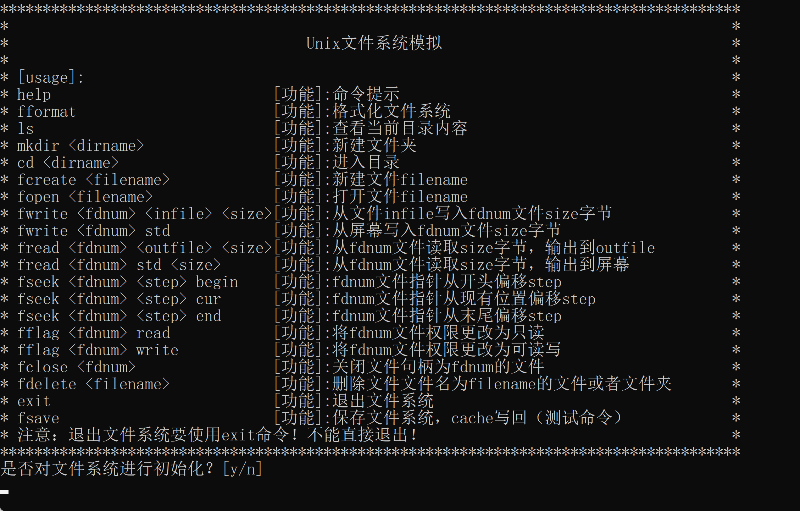

## 类UNIX二级文件系统

系同济大学计算机系操作系统课程设计项目

### 一，可执行文件

可执行文件\unix_fs.exe：可执行文件，双击执行

可执行文件\report.pdf：课程设计报告

### 二，源代码

源代码\cache.cpp：cache部分实现

源代码\head.h：所有数据结构的定义

源代码\main.cpp：程序入口

源代码\newfile.cpp：生成一个800字节的文件，用于测试

源代码\superblock.cpp：超级块部分实现，成组链接法（不正规，但不影响使用）

源代码\tools.cpp：绝大部分功能的实现部分

### 三，运行说明

详见运行说明部分txt
